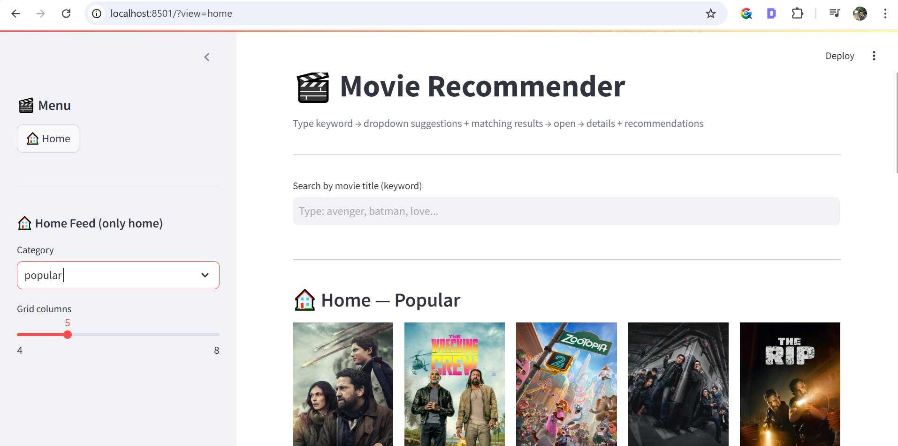
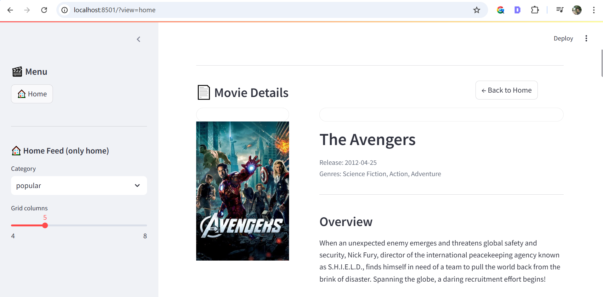

# 🎬 Movie Recommender System

A Movie Recommendation Web Application built with Python, Streamlit, and Machine Learning that suggests similar movies using content-based filtering.  
Movie posters and details are fetched using the TMDB API.

---

## 🚀 Features
- Search movies by name  
- Get similar movie recommendations  
- Genre-based recommendations  
- Movie posters and details  
- Interactive Streamlit UI  
- Fast and lightweight  

---

## 📸 Demo
  
  


---

## 🛠️ Tech Stack
- Python  
- Streamlit  
- Pandas  
- Scikit-learn  
- TMDB API  

---

## 📁 Project Structure
app.py
main.py
df.pkl
tfidf.pkl
tfidf_matrix.pkl
indices.pkl
requirements.txt
.env


---

## ⚙️ Setup Instructions

### 1. Clone repository
```bash
git clone https://github.com/rehanxhaikh/movie-recommender-system.git
cd movie-recommender-system


2. Create virtual environment

python -m venv venv
venv\Scripts\activate


3. Install dependencies

pip install -r requirements.txt


4. Add TMDB API key

Create .env file:

TMDB_API_KEY=your_api_key_here


▶️ Run Application

streamlit run app.py

Open in browser:

http://localhost:8501


🧠 How it Works

Uses TF-IDF Vectorizer

Cosine similarity for movie recommendations

TMDB API for posters and movie details


🔮 Future Enhancements

User login system

Collaborative filtering

Cloud deployment

Filters by rating and year


👨‍💻 Author

Rehan Shaikh
Master’s in Data Science – University of Mumbai


📜 License

This project is for educational purposes only.
